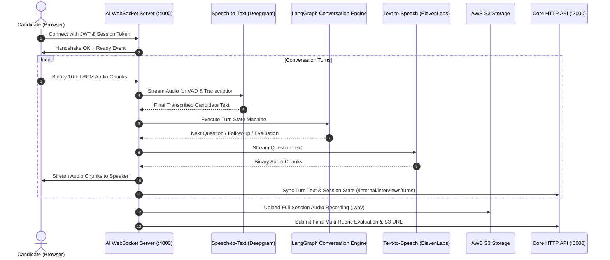

# AI Interview Real-Time Engine Skill (`apps/ai-interview`)

This skill defines the technical workflow and protocols for the **Coursity AI Interview Microservice** (`apps/ai-interview`).

---

## 🏛️ Real-Time Interaction Pipeline



---

## 🔄 Conversation State Machine & Rubrics

The interview flow is orchestrated as a state graph with strict evaluation boundaries:

```
[INIT / GREETING]
       │
       ▼
[ASSESS_BACKGROUND] ── (Clarify candidate experience & domains)
       │
       ▼
[TECHNICAL_QUESTIONS] ── (Core domain deep dives & scenario problems)
       │
       ▼
[PROBE_FOLLOW_UPS] ── (Evaluate edge cases, trade-offs & architecture)
       │
       ▼
[RUBRIC_SCORING] ── (Generate scores across 4 evaluation dimensions)
       │
       ▼
[CONCLUDE_SESSION] ── (Archive audio to S3, finalize report in apps/http)
```

### 4-Dimensional Evaluation Rubric
1. **Technical Depth (0-100)**: Accuracy of concepts, understanding of underlying runtime, systems design.
2. **Communication (0-100)**: Clarity, conciseness, structured thinking, and responsiveness.
3. **Pedagogical Ability (0-100)**: Ability to explain complex topics simply, empathy, and mentoring aptitude.
4. **Problem Solving (0-100)**: Methodical troubleshooting, trade-off analysis, and adaptability.

---

## 🔐 Inter-Service Security & Syncing Protocol

The AI Interview server communicates with `apps/http` using signed internal requests:
* **Header**: `x-internal-secret: <INTERNAL_SERVICE_SECRET>`
* **Endpoints**:
  * `POST /api/internal/interviews/sessions/start`
  * `POST /api/internal/interviews/turns`
  * `POST /api/internal/interviews/sessions/complete`
