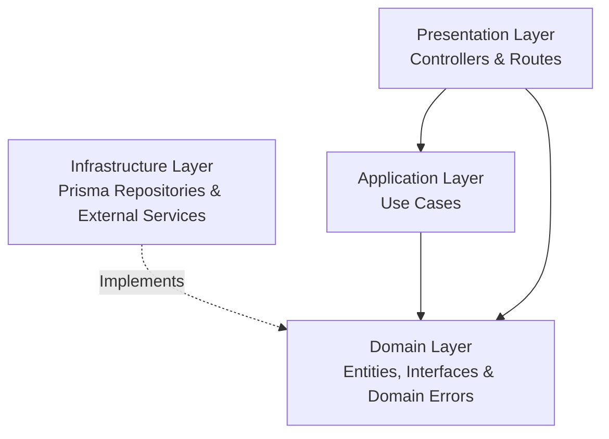

# Backend Clean Architecture & DDD Skill (`apps/http`)

This skill defines the development standard for the **Coursity Core REST API** (`apps/http`). All domain logic must strictly adhere to **Clean Architecture** and **Domain-Driven Design (DDD)** principles within our modular monolith.

---

## 🏛️ 4-Layer Module Architecture

Each module in [`apps/http/src/modules/<module-name>`](file:///d:/second-project/coursity-rebuild/apps/http/src/modules) must be strictly isolated into 4 distinct layers:

```
apps/http/src/modules/<module-name>/
├── domain/                      # 1. Enterprise Business Rules (Zero external dependencies)
│   ├── entities/                # Core business entities & domain invariants
│   ├── repositories/            # Repository interface contracts (Port definitions)
│   ├── dtos/                    # Domain data transfer objects
│   ├── constants/               # Domain-specific enums & constants
│   └── errors/                  # Custom domain error classes
│
├── application/                 # 2. Application Business Rules (Use Cases)
│   └── use-cases/               # Single-responsibility use case classes
│       └── <action>.usecase.ts
│
├── infrastructure/              # 3. Interface Adapters (Frameworks & Drivers)
│   ├── repositories/            # Prisma/Redis concrete repository implementations
│   └── services/                # S3, Nodemailer, Razorpay, or external integrations
│
├── presentation/                # 4. Presentation & Delivery (HTTP / Express)
│   ├── controllers/             # Express request/response controllers
│   ├── routes/                  # Express Router definitions with auth/role guards
│   └── schemas/                 # Zod request validation schemas
│
└── index.ts                     # Module Composition Root & Dependency Injection
```

---

## 📐 Layer Dependency Rules & Invariants



### Inviolable Rules:
1. **Domain Layer has NO external imports**: Never import `@prisma/client`, `express`, `zod`, or HTTP libraries into `domain/`.
2. **Use Cases depend on Repository Interfaces, NOT Prisma**: Always inject the interface defined in `domain/repositories/`, not concrete Prisma classes.
3. **Controllers are Thin**: Controllers only extract request data (validated by Zod), call the use case, and return standard `ApiResponse<T>`.
4. **Composition Root (`index.ts`) wires dependencies**: Each module must export a factory function `create<Domain>Module()` that instantiates repositories, use cases, controllers, and routers.

---

## 🛠️ Step-by-Step Runbook: Creating a New Backend Module

### Step 1: Define Domain Entity & Repository Interface
```typescript
// apps/http/src/modules/example/domain/entities/example.entity.ts
export interface ExampleEntity {
  id: string;
  title: string;
  creatorId: string;
  createdAt: Date;
  updatedAt: Date;
}

// apps/http/src/modules/example/domain/repositories/example.repository.ts
export interface IExampleRepository {
  findById(id: string): Promise<ExampleEntity | null>;
  create(data: { title: string; creatorId: string }): Promise<ExampleEntity>;
  update(id: string, data: Partial<ExampleEntity>): Promise<ExampleEntity>;
  delete(id: string): Promise<void>;
}
```

### Step 2: Implement Use Case
```typescript
// apps/http/src/modules/example/application/use-cases/create-example.usecase.ts
import { IExampleRepository } from "../../domain/repositories/example.repository";
import { ExampleEntity } from "../../domain/entities/example.entity";
import { BadRequestError } from "@/app/errors";

export interface CreateExampleDTO {
  title: string;
  creatorId: string;
}

export class CreateExampleUseCase {
  constructor(private readonly exampleRepo: IExampleRepository) {}

  async execute(dto: CreateExampleDTO): Promise<ExampleEntity> {
    if (!dto.title.trim()) {
      throw new BadRequestError("Title cannot be empty");
    }
    return this.exampleRepo.create(dto);
  }
}
```

### Step 3: Implement Prisma Repository
```typescript
// apps/http/src/modules/example/infrastructure/repositories/prisma-example.repository.ts
import { PrismaClient } from "@prisma/client";
import { IExampleRepository } from "../../domain/repositories/example.repository";
import { ExampleEntity } from "../../domain/entities/example.entity";

export class PrismaExampleRepository implements IExampleRepository {
  constructor(private readonly prisma: PrismaClient) {}

  async findById(id: string): Promise<ExampleEntity | null> {
    return this.prisma.example.findUnique({ where: { id } });
  }

  async create(data: { title: string; creatorId: string }): Promise<ExampleEntity> {
    return this.prisma.example.create({ data });
  }

  async update(id: string, data: Partial<ExampleEntity>): Promise<ExampleEntity> {
    return this.prisma.example.update({ where: { id }, data });
  }

  async delete(id: string): Promise<void> {
    await this.prisma.example.delete({ where: { id } });
  }
}
```

### Step 4: Define Zod Schemas & Controller
```typescript
// apps/http/src/modules/example/presentation/schemas/example.schema.ts
import { z } from "zod";

export const CreateExampleSchema = z.object({
  body: z.object({
    title: z.string().min(3, "Title must be at least 3 characters").max(100),
  }),
});

// apps/http/src/modules/example/presentation/controllers/example.controller.ts
import { Request, Response, NextFunction } from "express";
import { CreateExampleUseCase } from "../../application/use-cases/create-example.usecase";
import { ApiResponse } from "@/shared/utils/api-response";

export class ExampleController {
  constructor(private readonly createExampleUseCase: CreateExampleUseCase) {}

  create = async (req: Request, res: Response, next: NextFunction) => {
    try {
      const { title } = req.body;
      const creatorId = req.user!.id;
      const result = await this.createExampleUseCase.execute({ title, creatorId });
      return ApiResponse.created(res, result, "Created successfully");
    } catch (error) {
      next(error);
    }
  };
}
```

### Step 5: Define Routes & Composition Root
```typescript
// apps/http/src/modules/example/presentation/routes/example.routes.ts
import { Router } from "express";
import { ExampleController } from "../controllers/example.controller";
import { authenticate } from "@/app/middlewares/auth.middleware";
import { validate } from "@/app/middlewares/validate.middleware";
import { CreateExampleSchema } from "../schemas/example.schema";

export function createExampleRouter(controller: ExampleController): Router {
  const router = Router();
  router.post("/", authenticate, validate(CreateExampleSchema), controller.create);
  return router;
}

// apps/http/src/modules/example/index.ts
import { Router } from "express";
import defaultPrisma from "@/infrastructure/database/prisma.client";
import { PrismaExampleRepository } from "./infrastructure/repositories/prisma-example.repository";
import { CreateExampleUseCase } from "./application/use-cases/create-example.usecase";
import { ExampleController } from "./presentation/controllers/example.controller";
import { createExampleRouter } from "./presentation/routes/example.routes";

export function createExampleModule() {
  const exampleRepo = new PrismaExampleRepository(defaultPrisma);
  const createExampleUseCase = new CreateExampleUseCase(exampleRepo);
  const exampleController = new ExampleController(createExampleUseCase);
  const exampleRouter = createExampleRouter(exampleController);

  return { exampleRouter, exampleRepo, exampleController };
}

const defaultModule = createExampleModule();
export const exampleRouter = defaultModule.exampleRouter;
export default exampleRouter;
```

---

## 🛡️ Error Handling Hierarchy

Always throw standard error classes extending from `AppError` in [`src/app/errors/`](file:///d:/second-project/coursity-rebuild/apps/http/src/app/errors):
* `BadRequestError` (400)
* `UnauthorizedError` (401)
* `ForbiddenError` (403)
* `NotFoundError` (404)
* `ConflictError` (409)
* `RateLimitExceededError` (429)
* `InternalServerError` (500)
