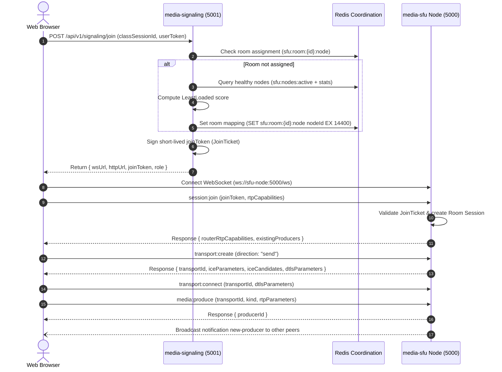

# 🎥 WebRTC SFU & Media Signaling Skill

This skill provides architectural guidance, protocols, and workflows for **Coursity's Live Media & SFU Subsystem**.

---

## 🏛️ Two-Tier Live Media Architecture

Coursity separates media handling into two independently scalable tiers coordinated via Redis:

```
                            ┌──────────────────────────────────┐
    Clients (WS / REST) ───▶│   media-signaling (Stateless)    │ : Port 5001
                            │   HPA on CPU / Conns             │
                            └────────────────┬─────────────────┘
                                             │
             ┌───────────────────────────────┴───────────────────────────────┐
             ▼                                                               ▼
   ┌───────────────────┐                                           ┌───────────────────┐
   │   Redis Cluster   │                                           │     apps/http     │
   │  - room registry  │◀──────────────────────────────────────────│   (Core Domain)   │
   │  - node stats/info│                                           └───────────────────┘
   │  - pub/sub bus    │
   └─────────┬─────────┘
             │ Node stats & heartbeat polling (sfu:node:{id}:stats)
  ┌──────────┴──────────┬──────────────────────┐
  ▼                     ▼                      ▼
┌──────────────┐ ┌──────────────┐      ┌──────────────┐
│ media-sfu #1 │ │ media-sfu #2 │ ...  │ media-sfu #N │ : Port 5000 (HTTP/WS)
│ (Mediasoup)  │ │ (Mediasoup)  │      │ (Mediasoup)  │ : UDP 20000-20100 (WebRTC)
└──────────────┘ └──────────────┘      └──────────────┘
```

---

## 📦 Services Breakdown

### 1. `apps/media-signaling` (Stateless Gateway & Node Allocator)
- **Stack**: Express 5, TypeScript, WebSockets (`ws`), `ioredis`, `jsonwebtoken`, Zod.
- **Port**: `5001` (HTTP & `/ws`).
- **Core Responsibilities**:
  - Authenticates users and checks session enrollment against `apps/http`.
  - Runs placement algorithms (`LeastLoadedStrategy`) to pick the least-loaded live SFU node.
  - Registers room-to-node mappings in Redis (`sfu:room:${roomId}:node`) with sliding TTL.
  - Issues HMAC-signed short-lived `JoinTicket` tokens containing participant roles and permissions.

### 2. `apps/media-sfu` (Stateful Mediasoup SFU Node Daemon)
- **Stack**: Node.js 22, Mediasoup v3 C++ Worker pool, WebSockets (`ws`), `ioredis`, Zod.
- **Port**: `5000` (HTTP & `/ws`), `20000-20100/udp` (RTC Media Ports).
- **Core Responsibilities**:
  - Spawns multi-core Mediasoup Workers (`WorkerPool`).
  - Manages room Routers (`RouterManager`) and WebRTC send/receive Transports (`TransportFactory`).
  - Tracks Producers (audio, video, screen) and Consumers per participant in memory.
  - Broadcasts health heartbeats to Redis (`sfu:node:${nodeId}:stats`) every 5 seconds.

---

## 📡 End-to-End Client Signaling Flow



---

## ⚖️ Placement Scoring Formula

The `LeastLoadedStrategy` scores healthy candidates using weighted load metrics (lower score is better):

$$\text{Score} = (\text{CPU}\% \times 0.40) + (\text{Mem}\% \times 0.20) + (\min(100, \text{Rooms} \times 10) \times 0.20) + (\min(100, \text{Consumers} \times 2) \times 0.20)$$

---

## 🔒 Redis Coordination Schema

| Key | Type | Description |
| :--- | :--- | :--- |
| `sfu:nodes:active` | Set | Active SFU node IDs currently emitting heartbeats |
| `sfu:node:{id}:info` | Hash | Node network details (`nodeId`, `wsUrl`, `httpUrl`, `registeredAt`) |
| `sfu:node:{id}:stats` | Hash (TTL: 15s) | Dynamic load stats (`cpuPercent`, `activeRooms`, `activeConsumers`, `lastHeartbeat`) |
| `sfu:room:{id}:node` | String (TTL: 4h) | Pinning map of `classSessionId` $\rightarrow$ `nodeId` |
| `sfu:rooms:active` | Set | Set of currently allocated active room IDs |
| `sfu:events:bus` | PubSub Channel | Cross-service coordination events (`session:released`, `node:drain`) |
| `sfu:room:{id}:chat` | List (TTL: 4h) | Recent live chat messages list (capped at 100) |
| `sfu:room:{id}:chat:pinned` | String (TTL: 4h) | Current teacher pinned announcement message JSON |
| `sfu:room:{id}:poll:active` | String (TTL: 4h) | Current active poll entity JSON |
| `sfu:room:{id}:poll:{pollId}:votes` | Hash (TTL: 4h) | Map of `userId` $\rightarrow$ `optionId` |
| `sfu:room:{id}:events` | PubSub Channel | Real-time room events distribution (`chat:message`, `poll:updated`, `room:reaction`) |

---

## 📺 YouTube Live Broadcast Model (One-to-Many Streaming)

In YouTube Live classroom mode:
1. **Teacher (Broadcaster)**:
   - Publishes WebRTC Audio and Video RTP streams (`canProduceAudio: true`, `canProduceVideo: true`, `canProduceScreen: true`).
   - Creates and ends live interactive polls (`poll:create`, `poll:end`).
   - Pins important announcements and moderates chat comments (`chat:pin`, `chat:delete`).
2. **Students (Viewers)**:
   - Consume/subscribe to the Teacher's WebRTC streams (`canConsume: true`).
   - Strictly forbidden by `apps/media-sfu` from creating send transports or publishing media (`canProduceAudio: false`, `canProduceVideo: false`, `canProduceScreen: false`).
   - Can post real-time comments (`chat:send`) with rate limiting.
   - Can vote on active polls (`poll:vote`) and receive live percentage updates.
   - Can send live emoji reactions (`room:reaction`).

---

## 💬 Live Comments & Polls Signaling Protocol

### Client to Server WebSocket Messages (`/ws` on `apps/media-signaling`)
- `room:enter` $\rightarrow$ Payload: `{ roomId, token?, displayName? }`. Returns initial state: recent chat history, pinned comment, active poll.
- `chat:send` $\rightarrow$ Payload: `{ roomId, message, pinned? }`. Broadcasts `chat:message` event.
- `chat:pin` $\rightarrow$ Payload: `{ roomId, commentId, pinned }` (Teacher only). Broadcasts `chat:pinned` event.
- `chat:delete` $\rightarrow$ Payload: `{ roomId, commentId }` (Teacher or author). Broadcasts `chat:deleted` event.
- `poll:create` $\rightarrow$ Payload: `{ roomId, question, options, durationSeconds? }` (Teacher only). Broadcasts `poll:created` event.
- `poll:vote` $\rightarrow$ Payload: `{ roomId, pollId, optionId }`. Computes percentages and broadcasts `poll:updated` event.
- `poll:end` $\rightarrow$ Payload: `{ roomId, pollId }` (Teacher only). Broadcasts `poll:ended` event.
- `poll:active` $\rightarrow$ Payload: `{ roomId }`. Returns active poll with `userVotedOptionId`.
- `room:reaction` $\rightarrow$ Payload: `{ roomId, reaction }`. Broadcasts floating emoji reaction event.

