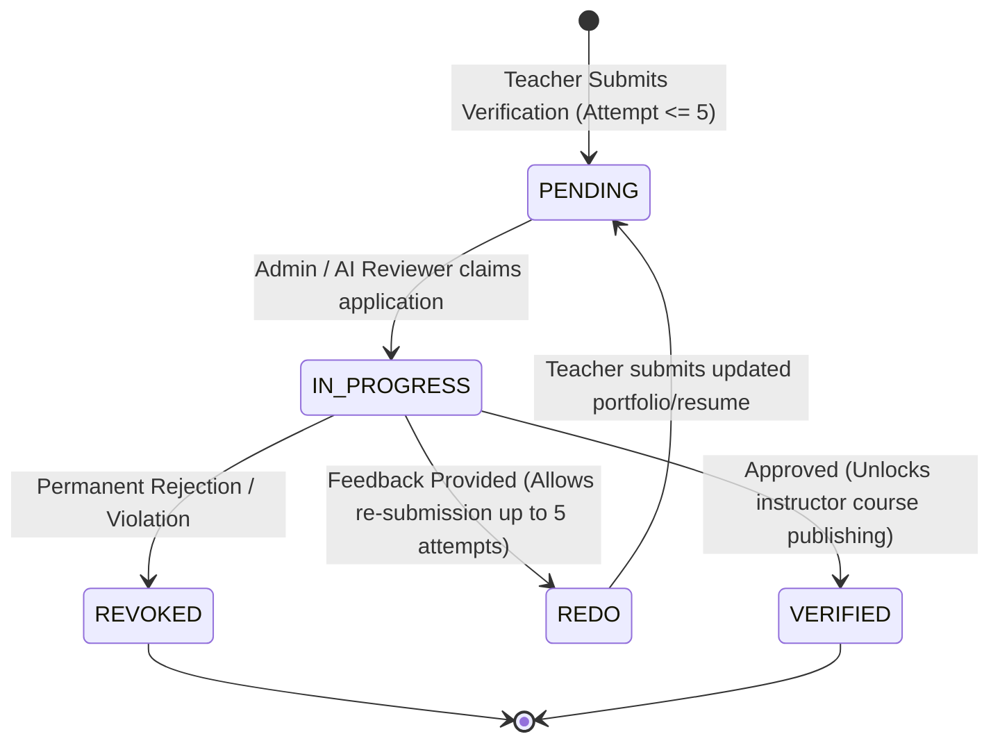

# Teacher Verification & Subscription Plans Skill

This skill documents the end-to-end domain rules and workflows for **Instructor Vetting, Dynamic Plan Tiers, and Metered Quota Enforcement**.

---

## 👩‍🏫 1. Teacher Verification State Machine



### Verification Invariants:
1. **Max Submission Attempts**: Teachers can submit verification at most **5 times**. Further submissions must be blocked with `BadRequestError("Maximum submission attempts reached")`.
2. **Resume Storage**: Resumes must be stored in S3 and uploaded via presigned PUT URLs with content-type `application/pdf` or `application/msword`.
3. **Role Elevation**: Upon reaching `VERIFIED` status, the user's effective role permissions allow publishing public courses and hosting live interactive cohorts.

---

## 💎 2. Dynamic Plan Tiers & Feature Allocations

Plans define discrete quotas and capabilities:

| Feature Key | Type | Unit | Description |
| :--- | :--- | :--- | :--- |
| `MAX_COURSES` | Numeric Limit | Count | Maximum number of published courses |
| `LIVE_VIEWER_MINUTES` | Metered Limit | Minutes | Total live session attendee watch time per month |
| `CLOUD_STORAGE_GB` | Storage Limit | Gigabytes | S3 media & video storage quota |
| `AI_INTERVIEW_PREVIEW` | Boolean Flag | True/False | Access to AI vetting mock tests |
| `CUSTOM_BRANDING` | Boolean Flag | True/False | Custom domain & branded video player |

---

## 📊 3. Quota Enforcement Pattern

Before executing restricted operations (e.g. creating a course, starting a live stream), always run quota validation:

```typescript
// Example: Checking quota before creating a course
import { ISubscriptionRepository } from "../subscription/domain/repositories/subscription.repository";
import { ForbiddenError } from "@/app/errors";

export class ValidateCourseCreationQuotaUseCase {
  constructor(private readonly subscriptionRepo: ISubscriptionRepository) {}

  async execute(teacherId: string): Promise<void> {
    const activeSub = await this.subscriptionRepo.findActiveByTeacherId(teacherId);
    if (!activeSub) {
      throw new ForbiddenError("Active instructor subscription required to publish courses");
    }

    const currentUsage = await this.subscriptionRepo.getUsage(activeSub.id);
    const maxCoursesLimit = activeSub.plan.features.find(f => f.key === "MAX_COURSES")?.limitValue ?? 0;

    if (currentUsage.coursesCount >= maxCoursesLimit) {
      throw new ForbiddenError(`Course limit reached for current plan (${maxCoursesLimit}). Please upgrade.`);
    }
  }
}
```

---

## 💳 4. Razorpay Payment Lifecycle

1. **Order Creation**: Call `POST /api/plans/subscribe` -> Returns Razorpay `order_id`, `amount`, `currency`, and `key_id`.
2. **Client Checkout**: Frontend opens Razorpay modal with `order_id`.
3. **Signature Verification**:
   - HMAC SHA-256 signature verification:
   `expectedSignature = crypto.createHmac("sha256", secret).update(orderId + "|" + paymentId).digest("hex")`
4. **Subscription Activation**:
   - Create active subscription record with billing period start/end dates.
   - Send transactional invoice email via BullMQ email worker.
