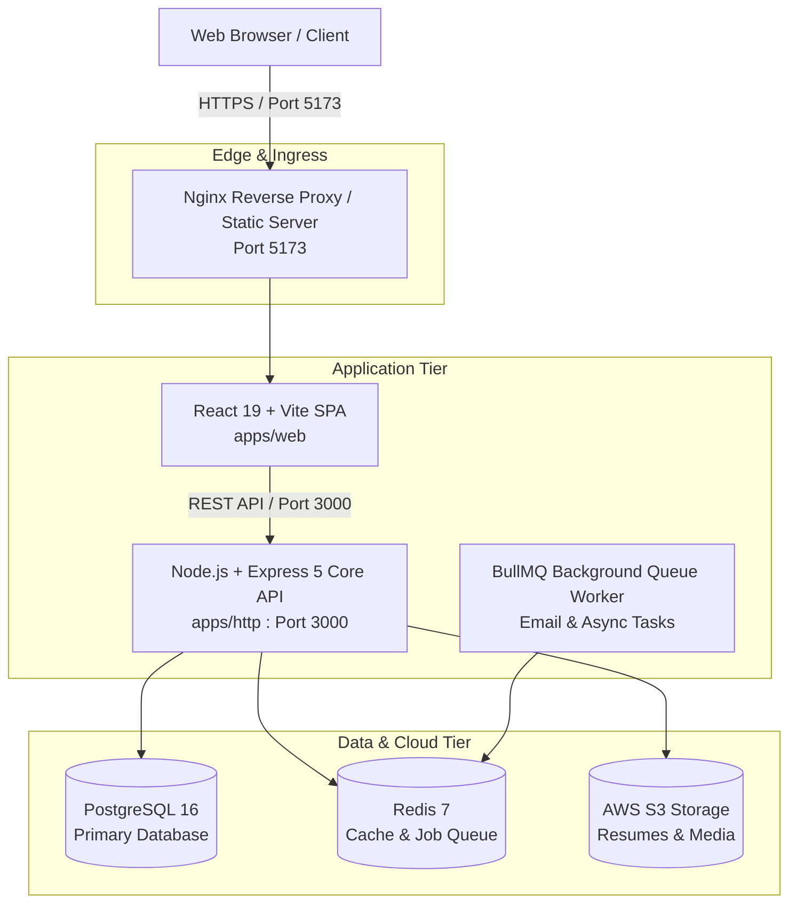

# 🎓 Coursity - Next-Gen Collaborative Learning Platform

Welcome to **Coursity** — a modular, cloud-ready educational platform designed for modern online learning, live interactive cohorts, teacher verification vetting, and scalable subscription tiers.

---

## 🏛️ System Architecture

Coursity is structured as a **Modular Monolith** in a containerized monorepo. It cleanly separates the Single Page Application (SPA) frontend, the domain-driven REST API backend, persistent caching, database engines, and cloud storage:



---

## 📦 Repository & Service Map

The repository is divided into self-contained applications located in [`/apps`](file:///d:/second-project/coursity-rebuild/apps):

| Service | Path | Tech Stack | Documentation |
| :--- | :--- | :--- | :--- |
| **Frontend Web App** | [`apps/web`](file:///d:/second-project/coursity-rebuild/apps/web) | React 19, Vite, Tailwind CSS, TanStack Query | [**Frontend README**](file:///d:/second-project/coursity-rebuild/apps/web/README.md) |
| **Core REST API** | [`apps/http`](file:///d:/second-project/coursity-rebuild/apps/http) | Express 5, TypeScript, Prisma ORM, BullMQ | [**Backend README**](file:///d:/second-project/coursity-rebuild/apps/http/README.md) |
| **AI Interview Engine** | `apps/ai-interview` | WebSockets, WebRTC, LLM Voice Orchestration | *(Roadmap)* |
| **Live Classroom SFU** | `apps/media-sfu` | Mediasoup, C++ Workers, WebRTC Video SFU | *(Roadmap)* |

---

## 🛠️ Technology Stack

* **Frontend:** React 19, Vite 6, TypeScript, Tailwind CSS v4, TanStack Query v5, React Router v7, Lucide Icons.
* **Backend:** Node.js 22, Express 5, TypeScript, Clean Architecture / DDD, Zod 4 runtime validation.
* **Database & ORM:** PostgreSQL 16, Prisma ORM 6 (Auto-migrations & Type-safe Client).
* **Caching & Queues:** Redis 7, BullMQ (Transactional email delivery, async tasks, idempotency).
* **Storage & Media:** AWS S3 (Presigned direct-to-S3 uploads for resumes and avatars).
* **DevOps & Containers:** Docker, Docker Compose (Development with live reload & Production multi-stage builds).

---

## 🚀 Quick Start (Dockerized)

The fastest way to spin up the complete Coursity stack (PostgreSQL, Redis, Backend, and Frontend):

### 1. Setup Environment Variables
Copy `.env.example` to `.env` in the root:
```bash
cp .env.example .env
```
*(On Windows PowerShell: `Copy-Item .env.example .env`)*

### 2. Start Multi-Container Stack

#### 🔹 Development Mode (Hot-Reloading for Code Modifications):
```bash
docker compose -f docker-compose.dev.yml up --build
```
- Code changes in `./apps/http/src` trigger hot-reload via `tsx watch`.
- Code changes in `./apps/web/src` reflect immediately via Vite Hot Module Replacement (HMR).

#### 🔹 Production Mode:
```bash
docker compose up --build -d
```

### 3. Access the Services
* **Frontend Web App:** [http://localhost:5173](http://localhost:5173)
* **Backend REST API:** [http://localhost:3000/api](http://localhost:3000/api)
* **Health Check:** [http://localhost:3000/health](http://localhost:3000/health)

---

## 💻 Manual Local Development (Without Docker)

If you prefer running services directly on your host machine:

### Prerequisites
* **Node.js**: v20 or v22+
* **PostgreSQL**: Running on port `5432`
* **Redis**: Running on port `6379`

### 1. Backend Setup (`apps/http`)
```bash
cd apps/http
npm install
npm run prisma:generate
npm run prisma:migrate
npm run dev
```

### 2. Frontend Setup (`apps/web`)
```bash
cd apps/web
npm install
npm run dev
```

---

## 📊 Core Business Capabilities

1. **Dual Role Architecture (Students & Teachers)**:
   - Students can discover courses, subscribe to plans, and track learning progress.
   - Teachers submit comprehensive verification applications (Resume upload to S3, LinkedIn/Website portfolios, Expertise tags, and Experience level).

2. **Teacher Verification & Approval State Machine**:
   - Statuses: `PENDING` ➔ `IN_PROGRESS` ➔ `VERIFIED` / `REDO` / `REVOKED`.
   - Max submission limits (5 attempts) and automated admin review feedback.

3. **Dynamic Plan & Metered Feature Catalog**:
   - Configurable feature limits (Live viewer minutes, max courses, cloud storage GB).
   - Real-time quota validation before executing restricted actions.

4. **Universal Debounced Search & Data Table Engine**:
   - Reusable `<SearchInput />` component ensuring 60fps input responsiveness while debouncing API queries.
   - Unified `<DataTableTemplate />` with pagination, faceted dropdown filters, and status tabs.

5. **Direct-to-S3 Cloud Storage**:
   - Direct browser-to-S3 uploads via presigned PUT URLs, eliminating backend memory overhead for large files.

---

## 🐳 Useful Docker Commands

```bash
# View live container logs
docker compose logs -f

# Follow logs for backend only
docker compose logs -f backend

# Open Prisma Studio in the container
docker compose exec backend npx prisma studio

# Stop containers (preserves database volumes)
docker compose down

# Stop containers and wipe database volumes
docker compose down -v
```

---

## 📚 Detailed Documentation

For in-depth guides, API endpoint lists, and component architectures, visit:
* [Backend Core API Guide (`apps/http/README.md`)](file:///d:/second-project/coursity-rebuild/apps/http/README.md)
* [Frontend Web SPA Guide (`apps/web/README.md`)](file:///d:/second-project/coursity-rebuild/apps/web/README.md)
