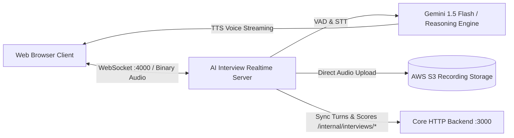

# 🎙️ Coursity — AI Interview Real-Time Engine (`apps/ai-interview`)

The **AI Interview Engine** is a specialized real-time voice and evaluation microservice designed for automated teacher vetting and interactive student technical evaluations.

---

## 🏛️ Architecture Overview



---

## 🚀 Key Capabilities

1. **Low-Latency Bi-Directional WebSockets**: Streaming 16-bit PCM binary audio frames.
2. **Real-time Voice Activity Detection (VAD)**: Energy-based turn detection and instant interruption/barge-in cancellation.
3. **Structured Agent State Machine**: Coordinates greeting, adaptive technical questions, follow-up probes, and evaluation conclusion.
4. **Multi-dimensional Rubric Scoring**: Scores candidates across *Technical Depth*, *Communication*, *Pedagogy*, and *Problem Solving*.
5. **Backend Synchronization**: Automatically updates session status, live turns, final report, and S3 recording URL in `apps/http`.

---

## ⚙️ Environment Variables (`.env`)

```env
PORT=4000
HTTP_BACKEND_URL=http://localhost:3000
INTERNAL_SERVICE_SECRET=coursity_internal_microservice_shared_secret_2026
JWT_SECRET=super_secret_interview_realtime_token_key

# 1. Reasoning & Cognitive LLM (Planning, Question Gen, Evaluation, Analysis)
LLM_PROVIDER=gemini
LLM_MODEL=gemini-1.5-flash
LLM_API_KEY=

# 2. Speech-to-Text / Audio Transcription (Candidate voice streaming -> text)
STT_PROVIDER=deepgram
STT_MODEL=nova-2
STT_API_KEY=

# 3. Text-to-Speech / Voice Synthesis (Interviewer voice synthesis)
TTS_PROVIDER=elevenlabs
TTS_MODEL=eleven_turbo_v2_5
TTS_VOICE_ID=21m00Tcm4TlvDq8ikWAM
TTS_API_KEY=

# 4. Session Audio Archive Cloud Storage
STORAGE_REGION=us-east-1
STORAGE_BUCKET_NAME=coursity-media
STORAGE_ACCESS_KEY=
STORAGE_SECRET_KEY=
```

---

## 💻 Running Locally

```bash
cd apps/ai-interview
npm install
npm run dev
```

Run tests:
```bash
npm test
```
